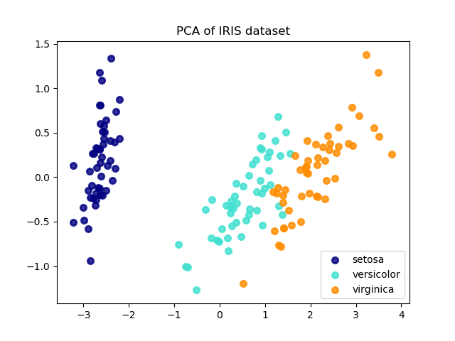

##	主成分分析

*	PCA, Principal Component Analysis, 主成分分析, 是最常用的一种降维方法。

*	构造一个超平面, 使得

	*	样本点到超平面的距离足够近

		```
		min -tr(WT·X·XT·W)
		s.t. WT·W = I
		```

	*	样本点在超平面的投影尽可能分开

		```
		max tr(WT·X·XT·W)
		s.t. WT·W = I
		```

*	算法描述

	```
	输入:
	样本集 D={x1, x2, ..., xm}
	      d' = 低维空间维数

	过程:
	1. 对所有样本进行中心化: xi = xi - (1/m)·Σ(xi)
	2. 计算样本协方差矩阵 X·XT = [1/(n-1)]·Σ(Xi - meanX)(Yi - meanY)
	3. 对协方差矩阵 X·XT 做特征值分解
	4. 取最大的 d' 个特征值对应的特征向量 w1, w2, ... wd'

	输出:
	投影矩阵 W* = (w1, w2, ..., wd')
	```

	<br>

##	`sklearn` 中的 `PCA`

*	`sklearn` 的 [documentation](https://scikit-learn.org/stable/modules/generated/sklearn.decomposition.PCA.html) 给出了一个结合 `iris` 数据集的示例, 删减后得到如下 `demo`

	```python
	import matplotlib.pyplot as plt

	from sklearn import datasets
	from sklearn.decomposition import PCA

	iris = datasets.load_iris()

	X = iris.data
	y = iris.target
	target_names = iris.target_names

	pca = PCA(n_components=2)
	X_r = pca.fit(X).transform(X)

	# Percentage of variance explained for each components
	print( 'explained variance ratio (first two components): %s' % str(pca.explained_variance_ratio_) )

	plt.figure()
	colors = ['navy', 'turquoise', 'darkorange']
	lw = 2

	for color, i, target_name in zip(colors, [0, 1, 2], target_names):
		plt.scatter(X_r[y == i, 0], X_r[y == i, 1], color=color, alpha=.8, lw=lw, label=target_name)
	plt.legend(loc='best', shadow=False, scatterpoints=1)
	plt.title('PCA of IRIS dataset')

	plt.show()
	```

	

*	[source code](https://scikit-learn.org/stable/auto_examples/decomposition/plot_pca_vs_lda.html#sphx-glr-auto-examples-decomposition-plot-pca-vs-lda-py)

	<br>

##	关于 PCA 在 Titanic 生存预测中的应用

*	最初在 ML 课程上接触到 PCA 之后, 想尝试用 PCA 对 Titanic 的数据集 `dataset` 进行特征分析。

	然而在学习的过程中我们发现, 样例所示的 iris 数据集是完整的、数值型的, 因此可以很方便地借助 `sklearn.decomposition.PCA` 进行主成分分析。

*	相比之下, 在Titanic 的数据集 dataset 中, 由于 `Cabin, Age` 等特征存在很多缺失值, `Name, Ticket` 等特征不是数值类型(`Sex, Embarked` 可以进行 `one_hot` 编码, 但是 `Name, Ticket` 取值太多了, 不适合 `one_hot`), 因此在做 PCA 之前仍然要对 dataset 进行其他特征分析和处理, 以便把数据放入 `sklearn.decomposition.PCA`, 否则很难有较好的效果。

*	因此暂停 PCA, 先继续学习和分析数据集的特征。

	TODO

	<br>

##	参考资料

*	[机器学习, 周志华](https://book.douban.com/subject/26708119/)

*	[主成分分析（PCA）原理详解](https://blog.csdn.net/zhongkelee/article/details/44064401)

*	[主成分分析（PCA）原理总结](http://www.cnblogs.com/pinard/p/6239403.html)

*	[Matlab中cov函数的算法](https://blog.csdn.net/raodotcong/article/details/5941602)

	由于矩阵中给出只是这些随机变量的样本, 根据概率论的知识我们知道, 由于我们不知道这些随机变量的概率分布（或联合概率分布）, 我们是不可能计算出这些随机变量的期望、方差或是协方差的, 而只能计算出它们的一个无偏估计, 即样本均值、样本方差与样本协方差。

*	[方差var、协方差cov、协方差矩阵（浅谈）（三）_函数cov ](http://blog.sina.com.cn/s/blog_9e67285801010twv.html)

*	[方差与样本方差、协方差与样本协方差](https://blog.csdn.net/lanchunhui/article/details/52894648)

*	[样本协方差矩阵](https://baike.baidu.com/item/%E6%A0%B7%E6%9C%AC%E5%8D%8F%E6%96%B9%E5%B7%AE%E7%9F%A9%E9%98%B5)

	样本协方差矩阵是总体协方差矩阵D(X)的无偏估计。

*	[PCA和协方差的理解](https://blog.csdn.net/SZU_Hadooper/article/details/72844602)

*	[PCA为什么要用协方差矩阵](https://blog.csdn.net/babywong/article/details/50085239)

*	[an identity for the sample covariance](http://dept.stat.lsa.umich.edu/~kshedden/Courses/Stat401/Notes/401-slr-slides.pdf)

*	[scikit-learn中PCA的使用方法](https://blog.csdn.net/u012162613/article/details/42192293)

*	[主成份分析(PCA)最详细和全面的诠释](https://mp.weixin.qq.com/s?__biz=MjM5MTgyNTk1NA==&mid=2649907627&idx=2&sn=e65f700bee531da5b16c6700ccf6a693&source=41#wechat_redirect)

*	[Kaggle:使用MNIST数据集进行PCA降维和LDA降维](https://blog.csdn.net/capecape/article/details/79163454)

*	[用scikit-learn学习主成分分析(PCA)](https://www.cnblogs.com/pinard/p/6243025.html)

*	[基于PCA的特征降维及应用](http://ssea.ustcsz.edu.cn:443/UploadFiles/courseResources/20181222/%E4%B8%93%E9%A2%98%E8%AE%A8%E8%AE%BA%E4%B8%80_%E5%9F%BA%E4%BA%8EPCA%E7%9A%84%E7%89%B9%E5%BE%81%E9%99%8D%E7%BB%B4%E5%8F%8A%E5%BA%94%E7%94%A8_2018122212265540.pdf)

*	[sklearn.decomposition.PCA](https://scikit-learn.org/stable/modules/generated/sklearn.decomposition.PCA.html)

*	[sklearn.decomposition.PCA, User Guide](https://scikit-learn.org/stable/modules/decomposition.html#pca)

*	[sklearn.decomposition.PCA, Comparison of LDA and PCA 2D projection of Iris dataset](https://scikit-learn.org/stable/auto_examples/decomposition/plot_pca_vs_lda.html#sphx-glr-auto-examples-decomposition-plot-pca-vs-lda-py)
