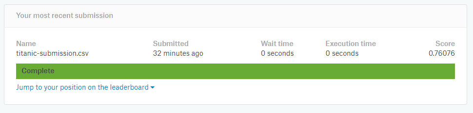

##	简介

*	使用逻辑回归模型进行生存预测

*	特征工程

	与特征工程相关的文件放在了文件夹 `feature_analysis` 中

	这里使用了 `'Sex', 'Age', 'Pclass', 'SibSp', 'Parch'` 作为输入特征

*	代码放在了 `./src` 文件夹下

*	结果放在了 `./result` 文件夹下

	 

##	Submission 截图

*	

	 

##	参考资料

*	[Titanic: Machine Learning from Disaster | Kaggle](https://www.kaggle.com/c/titanic)

*	[Kaggle入门 (Titanic TensorFlow Softmax)](https://blog.csdn.net/chenhaifeng2016/article/details/73136084)

	注1: 参考资料所给的模型中的 `.as_matrix()` 即将被 `pandas` 弃用, 新的用法是 `.values`

	注2: 参考模型中使用了 6 个特征, 而由我们之前的特征工程, 只用 5 个特征即可, 后期可以根据性能进行调试