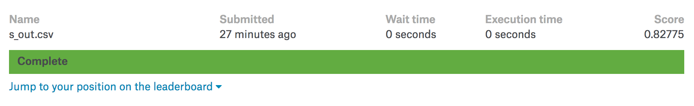

##	投票法(Majority Vote)

*	目前我们已经对数据集进行了不同的特征工程, 并使用不同的模型得到了多个预测输出 (`submission.csv`), 准确率在 `76.0%~80.1%` 之间

*	参考集成学习的的思想, 我们从现有的测试输出中选出准确率最高的 3 个 `csv` 文件, 然后进行 `majority vote`, 即

	```
	1. 假设预测准确率最高的3个csv文件是 s1, s2, s3, 记为 s_in, 待输出结果为 s_out

	2. 对于 s_in 中的同一行记录, 如果 s_in 有2个及以上的模型选择的是 1 (或0), 那么 s_out 对应的行的结果就是 1 (或0)

	3. 将更新后的预测结果保存为 s_majority_vote.csv
	```

	接着, 我们将上述逻辑转为代码

	```python
	import pandas as pd

	s1 = pd.read_csv('xmq.csv')
	s2 = pd.read_csv('yj.csv')
	s3 = pd.read_csv('ljj.csv')
	s4 = pd.read_csv('lzh.csv')
	s_out = s1

	size = len(s_out['Survived'])
	for i in range(size):
		v1 = s1['Survived'][i]
		v2 = s2['Survived'][i]
		v3 = s3['Survived'][i]
		sigma = v1 + v2 + v3
		if sigma > 1:
			s_out['Survived'][i] = 1
		else:
			s_out['Survived'][i] = 0

	s_out.to_csv('s_out.csv', index=False)
	```

*	对比之前准确率最高的结果 s1 和最新的结果 s_out, 可以发现两者有 23 条预测结果是不一样的

	```python
	import pandas as pd
	s1 = pd.read_csv('xmq.csv')
	s_out = pd.read_csv('s_out.csv')
	size = len(s_out['Survived'])
	cnt = 0
	for i in range(size):
		v1 = s1['Survived'][i]
		v_out = s_out['Survived'][i]
		if v1 != v_out:
			# print(i, v1, v_out)
			cnt += 1

	print(cnt)
	```

*	将 `s_majority_vote.csv` 提交至 `Kaggle` 平台, 观察并记录准确率, 结果发现得到的成绩比之前最好的成绩 (80.861%) 提升了约 2 个百分点, 达到了 `82.775%`

	

	说明 `majority_vote` 方法起到了一定的效果。

	<br>

